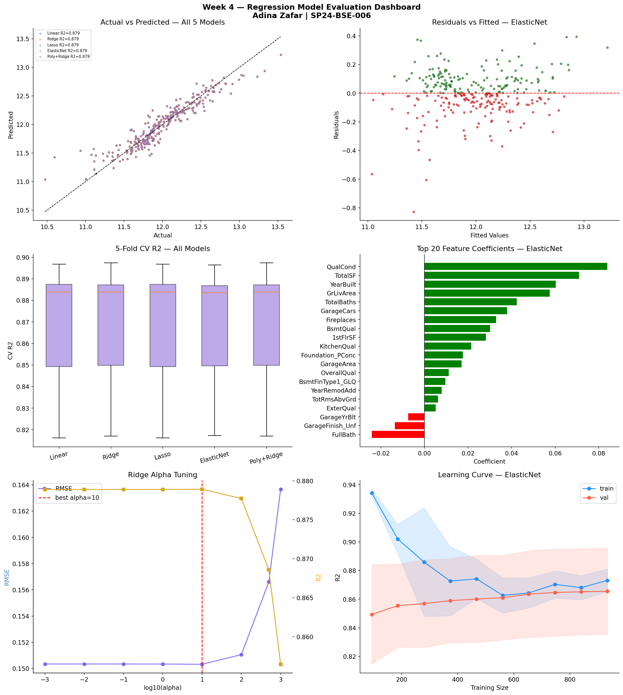

# Week 4 — Supervised Learning: Regression

**Student:** Adina Zafar | SP24-BSE-006
**Internship:** AI/ML Internship Program — Week 4 of 8
**Instructor:** Zain Ul Abideen

**Dataset**
House Prices — Advanced Regression Techniques
Source: Kaggle | 1460 rows, 81 columns | Target: SalePrice

**What I did this week**
trained 5 regression models on the house prices dataset using the cleaned and engineered features from week 3. this was the first week where i actually built ML models, not just prepared data. also did residual diagnostics, cross validation, and hyperparameter tuning with GridSearchCV.

**5 Models Trained**
| Model | Test R² | Dollar RMSE |
|---|---|---|
| ElasticNet (best) | 0.8793 | $31,185 |
| Lasso | 0.8789 | $31,136 |
| Poly+Ridge | 0.8789 | $31,120 |
| Ridge | 0.8789 | $31,120 |
| Linear Regression | 0.8789 | $31,133 |

best model: **ElasticNet (alpha=0.01, l1_ratio=0.1)** — highest CV R² at 0.8668 and lowest variance across folds

**5 Key Findings**
1. all 5 models performed almost identically — regularization barely moved the needle because multicollinearity was already cleaned up in week 3
2. ElasticNet won on consistency, not raw metrics — lowest standard deviation across CV folds
3. polynomial degree=3 gave train R²≈1.0 and test R²=−157 — the most extreme overfitting example i've seen so far
4. Lasso kept all 20 features even at low alpha, meaning none of the week 3 selected features were genuinely useless
5. luxury houses (OverallQual 9-10) had the biggest prediction errors — linear models struggle at the extremes

**Tools**
Python, Pandas, NumPy, Matplotlib, Seaborn, Scikit-learn, SciPy, Joblib

**Dashboard Preview**

